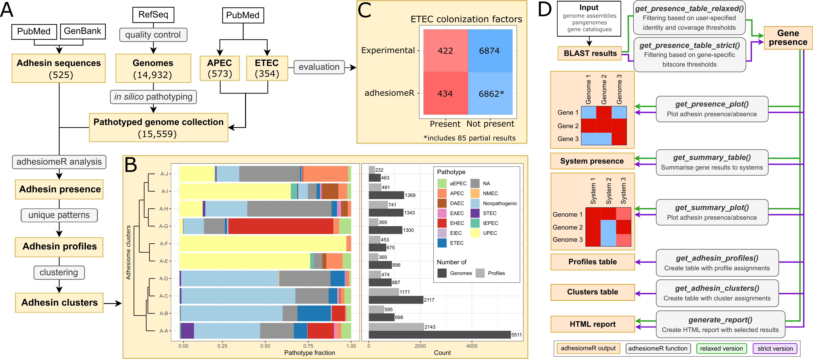

A) The workflow of the performed analyses. To create a pathotyped genome collection, we combined *E. coli* genomes available from RefSeq and performed *in silico* pathotyping. To extend the collection, we added APEC and ETEC genomes from other studies. Collected adhesin sequences were used to create a database for gene search, which is the main functionality of adhesiomeR. We analysed the collection of genomes using strict version of the search and we determined adhesin profiles based on the results. Then, we clustered adhesin profiles into clusters. B) Clustering based on all adhesin genes showing association of certain pathotypes with adhesiome clusters, please refer to Supplementary Information for all clustering results. C) Performance of adhesiomeR on experimentally validated adhesin systems from Von Mentzer et al., showing strong consistency (98% accuracy) between our *in silico* and *in vitro* results. See Figure S7 in the paper for more detailed comparisons. D) Functionalities implemented in adhesiomeR.
